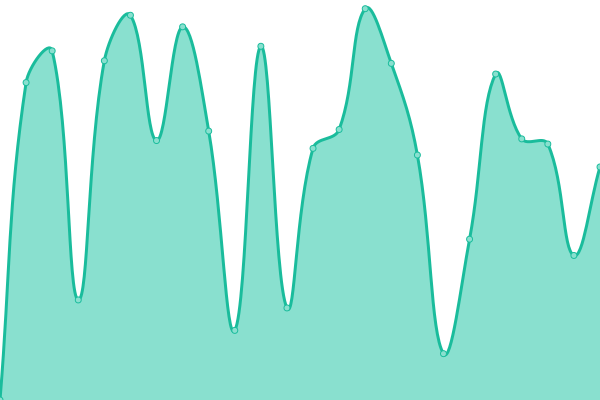
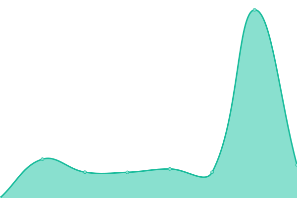

# [📈 Live Status](https://QUT-Digital-Observatory.github.io/test): <!--live status--> **🟩 All systems operational**

This repository contains the open-source uptime monitor and status page for [QUT Digital Observatory](https://www.qut.edu.au/digital-observatory), powered by [Upptime](https://github.com/upptime/upptime).

With [Upptime](https://upptime.js.org), you can get your own unlimited and free uptime monitor and status page, powered entirely by a GitHub repository. We use [Issues](https://github.com/QUT-Digital-Observatory/test/issues) as incident reports, [Actions](https://github.com/QUT-Digital-Observatory/test/actions) as uptime monitors, and [Pages](https://QUT-Digital-Observatory.github.io/test) for the status page.

<!--start: status pages-->
<!-- This summary is generated by Upptime (https://github.com/upptime/upptime) -->
<!-- Do not edit this manually, your changes will be overwritten -->
<!-- prettier-ignore -->
| URL | Status | History | Response Time | Uptime |
| --- | ------ | ------- | ------------- | ------ |
|  [Youte+](https://youteplus.digitalobservatory.net.au/) | 🟩 Up | [youte.yml](https://github.com/QUT-Digital-Observatory/monitoring/commits/HEAD/history/youte.yml) | 

 12690ms
     
 | 

<a href="https://QUT-Digital-Observatory.github.io/monitoring/history/youte">85.79%</a>
    

|  [NewsTalk](https://newstalk.digitalobservatory.net.au/) | 🟩 Up | [news-talk.yml](https://github.com/QUT-Digital-Observatory/monitoring/commits/HEAD/history/news-talk.yml) | 

 4835ms
     
 | 

<a href="https://QUT-Digital-Observatory.github.io/monitoring/history/news-talk">99.75%</a>
    

|  [AusReddit](https://ausreddit.digitalobservatory.net.au/) | 🟩 Up | [aus-reddit.yml](https://github.com/QUT-Digital-Observatory/monitoring/commits/HEAD/history/aus-reddit.yml) | 

 598ms
     
 | 

<a href="https://QUT-Digital-Observatory.github.io/monitoring/history/aus-reddit">98.81%</a>
    

|  [AusReddit API](https://ausreddit.digitalobservatory.net.au/api/v1/health/) | 🟩 Up | [aus-reddit-api.yml](https://github.com/QUT-Digital-Observatory/monitoring/commits/HEAD/history/aus-reddit-api.yml) | 

 191ms
     
 | 

<a href="https://QUT-Digital-Observatory.github.io/monitoring/history/aus-reddit-api">98.81%</a>
    

|  [Australian Digital Observatory](https://www.digitalobservatory.net.au/) | 🟩 Up | [australian-digital-observatory.yml](https://github.com/QUT-Digital-Observatory/monitoring/commits/HEAD/history/australian-digital-observatory.yml) | 

 152ms
     
 | 

<a href="https://QUT-Digital-Observatory.github.io/monitoring/history/australian-digital-observatory">100.00%</a>
    

<!--end: status pages-->

[**Visit our status website →**](https://QUT-Digital-Observatory.github.io/monitoring)

## 📄 License

- Powered by: [Upptime](https://github.com/upptime/upptime)
- Code: [MIT](./LICENSE) © [Anand Chowdhary](https://anandchowdhary.com), supported by [Pabio](https://pabio.com)
- Data in the `./history` directory: [Open Database License](https://opendatacommons.org/licenses/odbl/1-0/)
